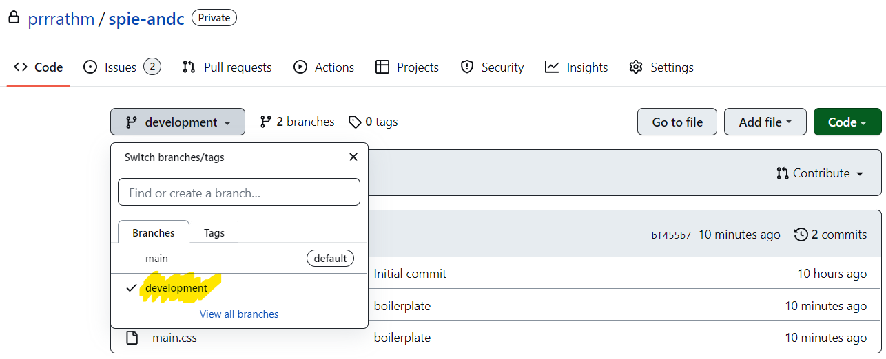
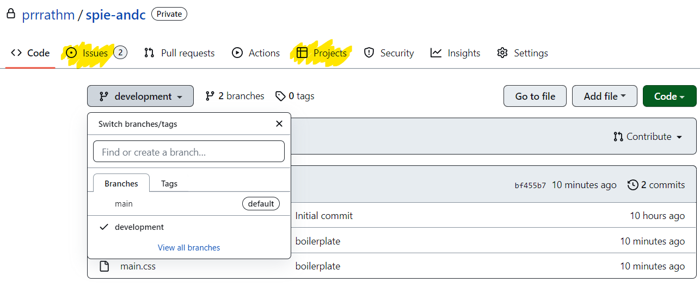

# spie-andc

## Welcome to Predeployment page of SPIE ANDC Chapter

### How to start working?

1. To start working clone the development branch or clone the main branch and switch to development branch

   
2. Tasks would be in issues & projects section

   
3. Create a new branch for every new issue/task and give it the task name and add a pull request when done

### Developer Team Resources :

1. Github 101 - [Code with Harry](https://www.youtube.com/watch?v=gwWKnnCMQ5c) | [Anuj Bhaiya](https://www.youtube.com/watch?v=uaeKhfhYE0U)
2. CSS 101 - [Beginner](https://www.youtube.com/watch?v=u5-K_ua9sOw) | [Flexbox](https://www.youtube.com/watch?v=uaeKhfhYE0U) | [Grid](https://www.youtube.com/watch?v=uaeKhfhYE0U)
3. Tailwind101 -
